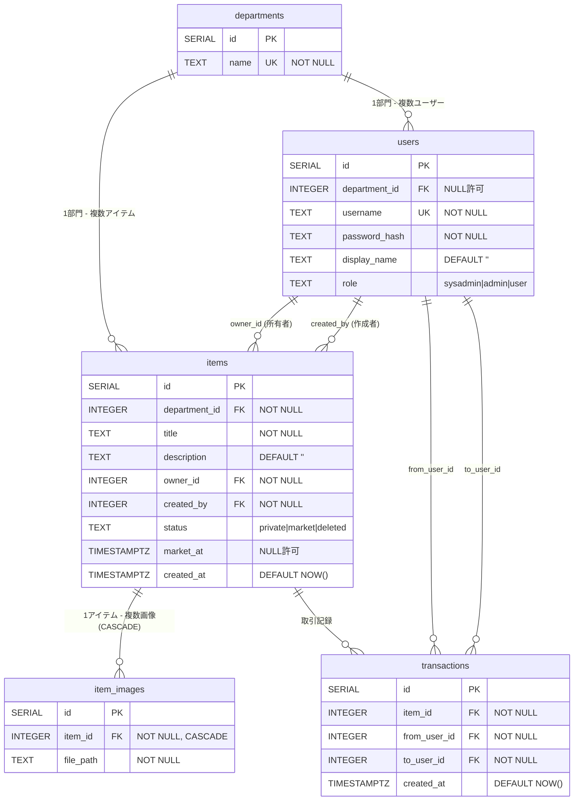

# データベース設計

## ER図



## テーブル定義

### departments（部門）

| カラム名 | 型 | 制約 | 説明 |
|---------|-----|------|------|
| id | SERIAL | PRIMARY KEY | 自動採番ID |
| name | TEXT | NOT NULL, UNIQUE | 部門名（重複不可） |

**用途：** マルチテナント分離の単位。各ユーザー・アイテムは必ずいずれかの部門に属する。

---

### users（ユーザー）

| カラム名 | 型 | 制約 | 説明 |
|---------|-----|------|------|
| id | SERIAL | PRIMARY KEY | 自動採番ID |
| department_id | INTEGER | REFERENCES departments(id), NULL許可 | 所属部門（sysadminはNULL） |
| username | TEXT | NOT NULL, UNIQUE | ログインID |
| password_hash | TEXT | NOT NULL | bcryptハッシュ値 |
| display_name | TEXT | NOT NULL, DEFAULT '' | 表示名（画面表示用） |
| role | TEXT | NOT NULL, DEFAULT 'user', CHECK(role IN ('sysadmin','admin','user')) | ロール |

**ロールの意味：**

| 値 | 説明 |
|----|------|
| `sysadmin` | システム管理者。部門管理・admin作成権限。department_idはNULL |
| `admin` | 部門管理者。自部門のユーザー管理・アイテム管理権限 |
| `user` | 一般ユーザー。自分のアイテム管理・マーケット利用権限 |

---

### items（アイテム）

| カラム名 | 型 | 制約 | 説明 |
|---------|-----|------|------|
| id | SERIAL | PRIMARY KEY | 自動採番ID |
| department_id | INTEGER | NOT NULL, REFERENCES departments(id) | 所属部門 |
| title | TEXT | NOT NULL | アイテム名称 |
| description | TEXT | NOT NULL, DEFAULT '' | 説明文（所有者が編集可） |
| owner_id | INTEGER | NOT NULL, REFERENCES users(id) | 現在の所有者 |
| created_by | INTEGER | NOT NULL, REFERENCES users(id) | 初期登録者（admin代理登録時に異なる） |
| status | TEXT | NOT NULL, DEFAULT 'private', CHECK(status IN ('private','market','deleted')) | 公開状態 |
| market_at | TIMESTAMPTZ | NULL許可 | マーケット出品日時（90日期限計算の基準） |
| created_at | TIMESTAMPTZ | NOT NULL, DEFAULT NOW() | 登録日時 |

**statusの状態遷移：**

```
private ──[出品]──→ market ──[申請・期限切れ]──→ private/deleted
  ↑                   │
  └────[取り下げ]──────┘
```

| 値 | 意味 |
|----|------|
| `private` | 非公開（本人のみ閲覧） |
| `market` | マーケット出品中（部門内全ユーザーが閲覧・申請可） |
| `deleted` | 期限切れ（出品後90日経過で自動設定） |

---

### item_images（アイテム画像）

| カラム名 | 型 | 制約 | 説明 |
|---------|-----|------|------|
| id | SERIAL | PRIMARY KEY | 自動採番ID |
| item_id | INTEGER | NOT NULL, REFERENCES items(id) ON DELETE CASCADE | 対象アイテム |
| file_path | TEXT | NOT NULL | ファイル相対パス（例: `42/1700000000000.jpg`） |

**ファイルパス形式：** `{item_id}/{Unix nanoseconds}{拡張子}`

アイテム削除時（ON DELETE CASCADE）にDB上のレコードは自動削除されるが、`uploads/`ディレクトリのファイルは手動削除が必要（現在の実装では画像個別削除時のみファイル削除）。

---

### transactions（取引履歴）

| カラム名 | 型 | 制約 | 説明 |
|---------|-----|------|------|
| id | SERIAL | PRIMARY KEY | 自動採番ID |
| item_id | INTEGER | NOT NULL, REFERENCES items(id) | 対象アイテム |
| from_user_id | INTEGER | NOT NULL, REFERENCES users(id) | 譲渡元ユーザー（元owner） |
| to_user_id | INTEGER | NOT NULL, REFERENCES users(id) | 譲渡先ユーザー（申請者） |
| created_at | TIMESTAMPTZ | NOT NULL, DEFAULT NOW() | 取引日時 |

マーケット申請が成立したときのみレコードが作成される。取り下げ・期限切れでは記録されない。

## インデックス

| インデックス名 | 対象テーブル | カラム | 条件 | 目的 |
|--------------|------------|--------|------|------|
| idx_items_department_status | items | (department_id, status) | なし | 部門内の特定ステータスアイテム一覧の高速検索 |
| idx_items_owner | items | (owner_id) | なし | ユーザーの所有アイテム一覧の高速検索 |
| idx_items_market_at | items | (market_at) | WHERE status = 'market' | 90日期限切れバックグラウンドジョブの高速処理 |

## マイグレーション管理

**ライブラリ：** `golang-migrate/migrate v4`

**ファイル構成：**
```
migrations/
├── 001_init.up.sql    # テーブル・インデックス作成
└── 001_init.down.sql  # テーブル・インデックス削除（ロールバック用）
```

**実行タイミング：** アプリ起動時に `main.go` の `runMigrations()` が自動実行。既に適用済みの場合は `ErrNoChange` となりスキップ。

**埋め込み：** `//go:embed migrations/*.sql` によりGoバイナリにSQLファイルを埋め込み。Dockerイメージへの個別コピーが不要。

## データベース接続設定

| 項目 | 値 |
|------|----|
| ドライバ | `lib/pq`（PostgreSQL） |
| 接続方式 | `database/sql` 標準インターフェース |
| 接続文字列 | 環境変数 `DATABASE_URL` から取得 |
| 接続確認 | 起動時に `db.Ping()` で疎通確認、失敗時はFatal終了 |
